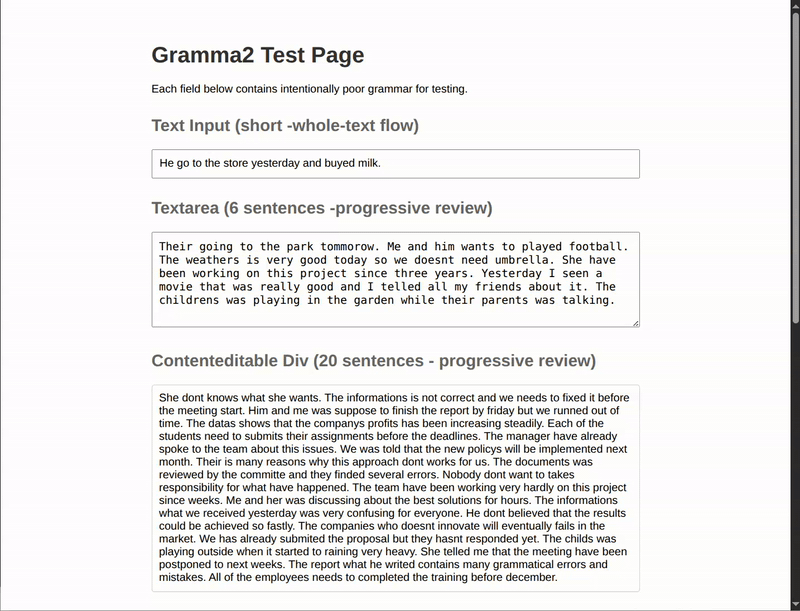
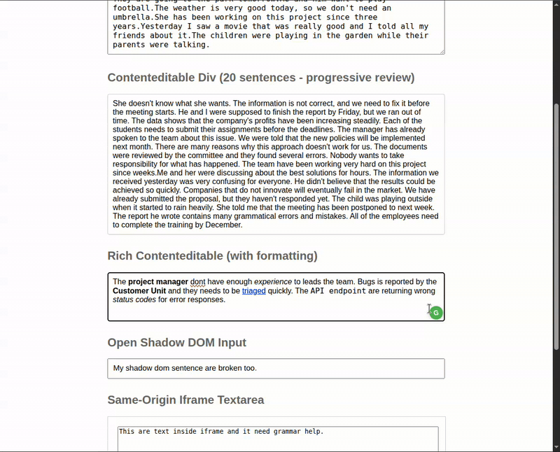
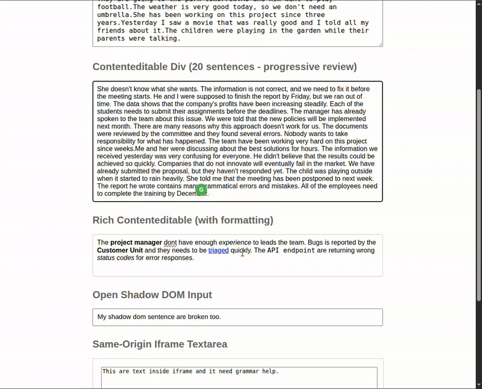
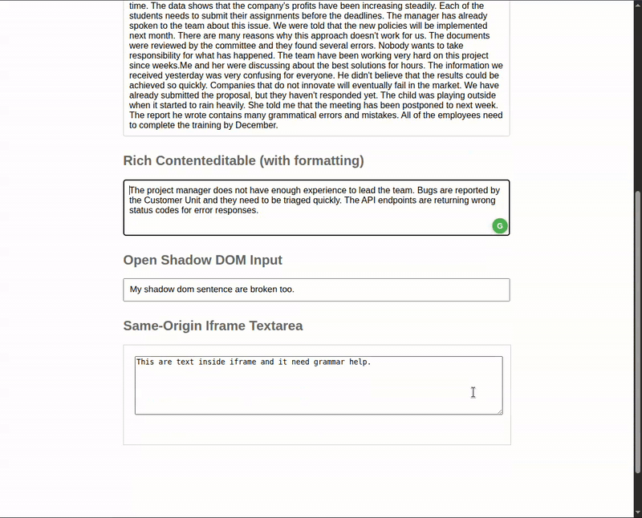

# Gramma2

Local-first browser writing assistant built as a Chrome extension plus FastAPI server. Focus any text field, click the floating **G** icon, choose a backend, review the suggestion, and apply it only if you want it.

## Demo

### Default suggestion popup

Single-field workflow: focus a text input, open the toolbar, request a fix, and apply the suggestion.



### Replace a sentence

Selection mode lets you target only part of a larger text instead of rewriting the whole field.



### Replace rich text safely

Rich-text editors use a conservative flow so formatting is not silently destroyed.



### Bulk replace longer text

Longer text can be reviewed block by block, then applied progressively or in one pass.



## Experiment Status

Gramma2 is being published as a personal GitHub experiment.

- Stable enough for local use and hacking
- Tested on Linux with an unpacked Chrome extension workflow
- Still intentionally narrow in scope: local-first, developer-oriented, and not Chrome Web Store packaged

## Why This Exists

Gramma2 is an open-source Grammarly-style experiment with explicit review UX: you see the correction before anything is replaced. It runs local-first with Ollama, supports progressive review for longer text, and keeps the architecture simple enough to hack on.

## Features

- Floating **G** icon on any focused text input, textarea, or contenteditable
- Local (Ollama) or Codex CLI backend — your choice per request
- Single-suggestion review: see the correction, click to apply
- Progressive long-text review: long text split into blocks, reviewed one at a time
- Selection mode: select a portion of text to review just that part
- In-memory LRU cache with TTL (avoids re-calling the LLM for repeated text)
- Works across iframes and frames
- Playwright end-to-end tests with real Chrome extension loading

## What Works Today

### Works well

- Standard `<input>` and `<textarea>` fields
- Basic `contenteditable` elements
- Long-text progressive review
- Local (Ollama) backend
- Fake backend for tests and demos
- Linux-based local development

### Works with caveats

- Rich-text editors (conservative replacement to avoid formatting damage)
- Codex backend (requires `codex` CLI install and authentication)
- Headed Playwright e2e on machines missing Chromium system libraries

### Out of scope

- Browser-internal privileged pages (`chrome://`, extensions page, etc.)
- Every complex editor framework (Slate, ProseMirror, etc.)
- Chrome Web Store packaging
- Non-Linux environments (may work but untested)

## How It Works

1. **Chrome extension** injects a floating **G** icon next to any focused text input, textarea, or contenteditable element
2. Clicking the icon shows a toolbar with backend options: **Local** (Ollama) or **Codex** (via the `codex` CLI)
3. The extension sends the text to a local Python server (`localhost:8555`) via the background service worker
4. The server calls the chosen LLM backend and returns a corrected suggestion
5. Click the suggestion to replace the original text

For longer text, the extension automatically splits it into sentence-aligned blocks and reviews them progressively.

## Quick Start

### Prerequisites

- Python 3.13.7
- [Ollama](https://ollama.com/) running locally
- Google Chrome or Chromium
- Linux (primary supported OS)

### Install

```bash
git clone https://github.com/mzyndul/gramma2.git
cd gramma2
python3 -m venv .venv
source .venv/bin/activate
pip install -r requirements.txt
playwright install chromium
playwright install-deps chromium  # system libraries for Chromium
```

### Pull an Ollama model

```bash
ollama pull qwen2.5:3b
```

### Start the server

```bash
source .venv/bin/activate
python3 -m server.main
```

The server validates that Ollama is reachable and the model is loaded before accepting requests. If Ollama is not running, the server exits with a clear error message. Codex CLI is checked but treated as optional.

Gramma2 does not call the OpenAI API directly and does not require you to paste an API key into the extension or server. The Codex option shells out to your locally installed, already authenticated `codex` command-line tool. The goal is to reuse an existing Codex CLI subscription or login flow instead of adding separate API-key management and direct API billing to this project.

### Load the extension

1. Open `chrome://extensions` in Chrome
2. Enable **Developer mode** (top right)
3. Click **Load unpacked** and select the `extension/` directory
4. Refresh the target page after loading the extension

This is an unpacked developer extension. It is not yet available on the Chrome Web Store.

### Use it

1. Focus any text input on any web page
2. Click the green **G** icon
3. Pick **Local** or **Codex** from the toolbar
4. Click the suggestion to replace your text

After first use, a regenerate button appears in the toolbar to re-run with the last used backend.

## Configuration

| Variable | Default | Description |
|---|---|---|
| `GRAMMA2_OLLAMA_MODEL` | `qwen2.5:3b` | Ollama model name |
| `GRAMMA2_CODEX_MODEL` | `o4-mini` | Codex CLI model name |
| `GRAMMA2_OLLAMA_URL` | `http://localhost:11434` | Ollama API URL |

## Backends

| Backend | Speed | Quality | Requires |
|---|---|---|---|
| **Local** (Ollama) | ~2-3s | Good for grammar fixes | Ollama running locally |
| **Codex** (CLI) | ~5-8s | Excellent | `codex` CLI installed + authenticated |
| **Fake** | Instant | N/A (`Fixed: ...` test stub) | Nothing (used in tests) |

Codex requests are executed through the local `codex` CLI, not through direct API calls from Gramma2 itself. If Codex CLI is not installed, the server starts normally with a notice. Requests to the codex backend will return an error; use the local backend instead.

## Running Tests

```bash
source .venv/bin/activate

# Server unit tests
python3 -m pytest tests/test_server.py -v

# End-to-end tests (opens a browser window)
python3 -m pytest tests/test_e2e.py -v

# All tests
python3 -m pytest tests/ -v
```

The real server must not be running on port 8555 when running tests (the test suite starts its own mock server).

For CI or headless environments:

```bash
sudo apt-get install -y xvfb
xvfb-run python3 -m pytest tests/test_e2e.py -v
```

### Troubleshooting

- **Port 8555 conflict**: Stop any running gramma2 server before running tests
- **Browser window required**: E2e tests need headed Chromium — extensions don't work in headless mode
- **Missing Chromium libraries**: Run `playwright install-deps chromium`

## Running with supervisor (optional)

To keep the server running in the background:

```ini
[program:gramma2]
command=/path/to/gramma2/.venv/bin/python3 -m server.main
directory=/path/to/gramma2
user=<your-username>
autostart=true
autorestart=true
stdout_logfile=/path/to/gramma2/logs/gramma2.log
stderr_logfile=/path/to/gramma2/logs/gramma2_err.log
environment=HOME="/home/<your-username>",PATH="<path-to-node-bin>:<path-to-codex-bin>:/usr/local/bin:/usr/bin:/bin"
```

Make sure `PATH` includes directories for `node` and `codex` if you use the Codex backend. Create the `logs/` directory first (`mkdir -p logs`), then:

```bash
supervisorctl reread && supervisorctl update
```

## Architecture

### Project Structure

```
gramma2/
├── server/           # FastAPI server, backends, cache, and prompt template
│   ├── app.py        # FastAPI routes
│   ├── main.py       # Uvicorn entrypoint + startup validation
│   ├── service.py    # Request orchestration + cache
│   ├── backends.py   # Ollama / Codex / fake backends
│   ├── cache.py      # In-memory LRU cache with TTL
│   └── prompt.py     # LLM prompt template
├── extension/        # Chrome Manifest V3 extension
│   ├── manifest.json
│   ├── content.js    # Icon, toolbar, popup, review UX
│   ├── background.js # Service worker (proxies requests to server)
│   └── styles.css
├── tests/            # Server unit tests + Playwright e2e tests
│   ├── test_server.py
│   ├── test_e2e.py
│   ├── conftest.py
│   └── test_page.html
└── requirements.txt
```

### Data Flow

```
Content script -> Background service worker -> FastAPI server (:8555)
  -> LRU cache check -> Ollama or Codex backend -> suggestion returned
  -> popup displayed -> user clicks to accept/reject
```

### Key Design Decisions

- **Manifest V3 service worker** proxies requests to avoid CORS issues from the content script
- **In-memory LRU cache** with SHA-256 keys (text + backend + model + prompt version) and 1-hour TTL
- **Progressive review** splits long text into sentence-aligned blocks for incremental review
- **Rich-text replacement** is intentionally conservative — blocks auto-apply on rich contenteditable to avoid formatting damage
- **Startup validation** requires Ollama to be reachable; Codex is optional

## Supported Environment

- **OS**: Linux (tested on Ubuntu)
- **Python**: 3.13.7
- **Browser**: Chrome / Chromium

Other environments may work but are not tested.

## Known Limitations

- Not all browser surfaces are supported — browser-privileged pages are out of scope
- Some complex editors (Slate, ProseMirror, etc.) may behave differently
- Quality depends on the chosen LLM backend and model
- Long-text latency depends on model speed and text length
- Rich-text editing is intentionally conservative to avoid destructive edits
- Local setup may require extra system libraries for Chromium/Playwright

## Roadmap

- CI workflow (GitHub Actions)
- Chrome Web Store packaging guide
- Architecture diagram
- More backend options

## Contributing

See [CONTRIBUTING.md](CONTRIBUTING.md).

## License

MIT. See [LICENSE](LICENSE).
